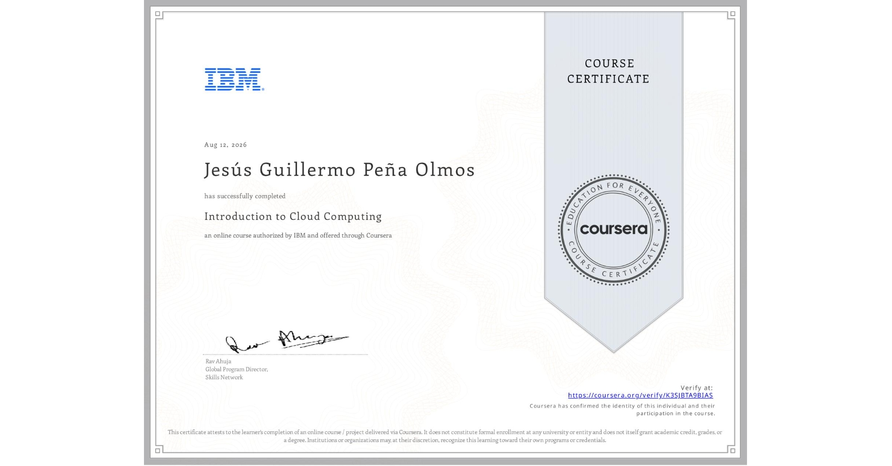

# ☁️ Course 2: Introduction to Cloud Computing / Introducción a la Computación en la Nube

This directory contains notes, summaries, and key architectural concepts learned during the second course of the **IBM Full Stack Software Developer Professional Certificate** program on Coursera.

## 📌 General Overview / Resumen General
This course covers the core concepts of cloud computing, including service models (IaaS, PaaS, SaaS), deployment models (Public, Private, Hybrid, Multi-cloud), cloud infrastructure, virtualization, containerization, serverless architectures, cloud security, and cloud-native practices.

---

Este directorio contiene las notas, resúmenes y conceptos clave de arquitectura aprendidos durante el segundo curso del programa **IBM Full Stack Software Developer Professional Certificate** en Coursera.

El curso abarca los conceptos fundamentales de la computación en la nube, incluyendo modelos de servicio (IaaS, PaaS, SaaS), modelos de despliegue (Pública, Privada, Híbrida, Multi-cloud), infraestructura en la nube, virtualización, contenedorización, arquitecturas serverless, seguridad en la nube y prácticas cloud-native.

## 🗺️ Course Index / Contenido del Curso

* 📖 [Module 1: Overview of Cloud Computing / Módulo 1: Visión General de la Computación en la Nube](./module-1/)
* 📖 [Module 2: Cloud Computing Models & Services / Módulo 2: Modelos y Servicios de la Nube](./module-2/)
* 📖 [Module 3: Cloud Infrastructure & Architecture / Módulo 3: Infraestructura y Arquitectura](./module-3/)
* 📖 [Module 4: Emerging Trends & Cloud-Native Apps / Módulo 4: Tendencias y Aplicaciones Cloud-Native](./module-4/)
* 📖 [Module 5: Cloud Security, Monitoring & Careers / Módulo 5: Seguridad, Monitoreo y Salidas Laborales](./module-5/)
* 📖 [Module 6: Final Hands-on Project & Assessment / Módulo 6: Proyecto Práctico Final](./module-6/)

## 📜 Certificate / Certificado

    

* 🎓 **Official Certificate:** Issued by IBM via Coursera.
* 🎓 **Certificado Oficial:** Emitido por IBM a través de Coursera.

---
*Maintained by / Notas mantenidas por [GuillermoOlmosDev](https://github.com/GuillermoOlmosDev)*