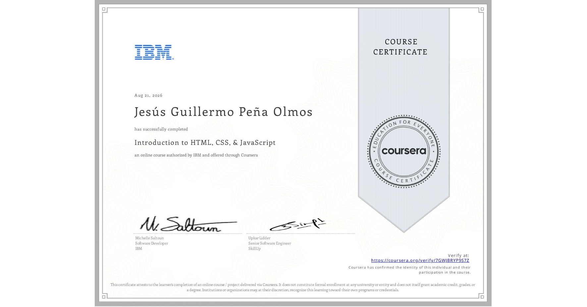

# 🌐 Course 3: Introduction to Web Development with HTML, CSS & JavaScript
# 🌐 Curso 3: Introducción al Desarrollo Web con HTML, CSS y JavaScript

This directory contains notes, concepts, and project source code developed during the third course of the **IBM Full Stack Software Developer Professional Certificate** program on Coursera.

## 📌 General Overview / Resumen General
This course covers frontend fundamentals: structuring web pages using HTML5, designing responsive interfaces with CSS3 and modern CSS frameworks, adding client-side interactivity and logic with vanilla JavaScript, manipulating the DOM, and building a final static portfolio project.

---

Este directorio contiene notas, conceptos y el código fuente del proyecto desarrollado durante el tercer curso del programa **IBM Full Stack Software Developer Professional Certificate** en Coursera.

El curso abarca los fundamentos de frontend: estructuración de páginas web con HTML5, diseño de interfaces adaptables con CSS3 y frameworks modernos, adición de interactividad y lógica del lado del cliente con JavaScript vanila, manipulación del DOM y la construcción de un proyecto final de portafolio estático.

## 🗺️ Course Index / Contenido del Curso

* 📖 [Module 1: Getting Started with HTML5, DOM & Tooling / Módulo 1: Introducción a HTML5, DOM y Herramientas](./module-1/)
* 📖 [Module 2: HTML5 Structural Elements, Forms & CSS Styling / Módulo 2: Elementos de HTML5, Formularios y Estilos CSS](./module-2/)
* 📖 [Module 3: JavaScript Fundamentals & DOM Manipulation / Módulo 3: Fundamentos de JavaScript y Manipulación del DOM](./module-3/)
* 📖 [Module 4: Final Hands-on Project - Portfolio Web App / Módulo 4: Proyecto Práctico Final - Portafolio Web](./module-4/)

## 📜 Certificate / Certificado

  

* 🎓 **Official Certificate:** Issued by IBM via Coursera 
* 🎓 **Certificado Oficial:** Emitido por IBM a través de Coursera 

---
*Maintained by / Notas mantenidas por [GuillermoOlmosDev](https://github.com/GuillermoOlmosDev)*